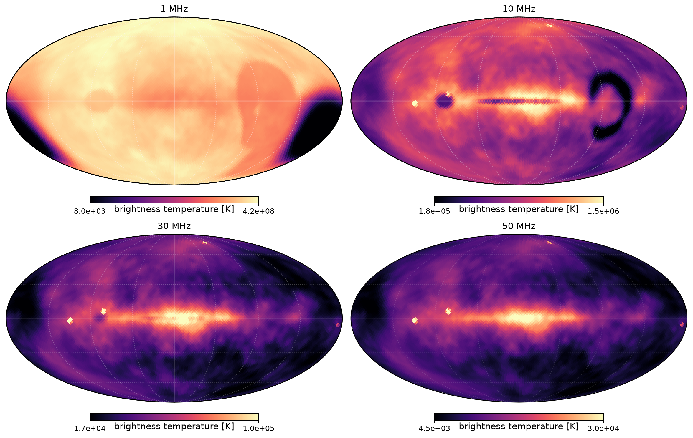

# lowsky

`lowsky` makes physics-based, counterfactual low-frequency skies. It models
the Milky Way in three dimensions instead of copying residual pixels from
Haslam or ULSA.



The model includes synchrotron emission, free-free transfer, spiral structure,
the Local Bubble, nearby shells and spurs, Gum, Orion–Eridanus, Cygnus X, an
isotropic extragalactic background, and optional analytic A-team sources.

## Install

Python 3.12 is required.

```bash
pip install "lowsky @ git+https://github.com/lusee-night/lowsky.git"
```

For development:

```bash
git clone https://github.com/lusee-night/lowsky.git
cd lowsky
uv sync --extra dev
```

## Differentiable API

`generate_sky` is the main package output. It is written entirely with JAX and
returns brightness temperature in kelvin with shape `(frequency, pixel)`.

```python
import jax
import jax.numpy as jnp

from lowsky import SkyConfig, SkyParameters, generate_sky, prepare_sky_inputs

# Geometry, seeded random fields, and catalogs are prepared outside the JAX graph.
inputs = prepare_sky_inputs(
    SkyConfig(nside=32, ray_oversample=1, sky_mode="ours", seed=20260901)
)
parameters = SkyParameters(
    emissivity_scale=1.0,
    emission_measure_scale=1.0,
    spectral_index_offset=0.0,
)

frequencies_mhz = jnp.array([1.0, 10.0, 30.0, 50.0])
sky_k = jax.jit(generate_sky)(frequencies_mhz, inputs, parameters)
```

`SkyInputs` and `SkyParameters` are JAX pytrees. The output can be used with
`jax.jit`, `jax.grad`, `jax.jacfwd`, and `jax.vmap`. Use
`generate_sky_components` when individual physical components are needed.

## ULSA drop-in file

Create a replacement for `ULSA_32_ddi_smooth.fits` without reading the mounted
ULSA artifact:

```bash
uv run python examples/export_ulsa_dropin.py \
  --sky-mode ours \
  --output ULSA_32_ddi_smooth.fits
```

The writer enforces the LuSEEpy contract: one float64 primary HDU containing
50 Galactic RING-ordered NSIDE-32 maps for 1–50 MHz, with the original ULSA
header layout.

## Full pipeline

The calibrated pipeline compares a realization with an external ULSA reference,
creates diagnostic FITS maps, and saves canonical un-beamed harmonic products:

```bash
lowsky-generate \
  --mounted-ulsa /path/to/ULSA_32_ddi_smooth.fits \
  --sky-mode ours \
  --output-dir lowsky-output
```

Extended components are generated on the higher-resolution ray grid and then
transformed to spherical harmonics. Cas A, Cyg A, Tau A, and Vir A are inserted
as analytic band-limited delta functions. A beam is applied only to diagnostic
maps.

Additional examples:

```bash
uv run python examples/plot_harmonic_power.py --help
uv run python examples/validate_feature_fidelity.py --help
```

Validation notebooks are in [`notebooks/`](notebooks/). The diffuse morphology
has been resolution-validated through `ell = 64`; higher multipoles are retained
but should not be interpreted as converged small-scale structure.

## Scope

This is a controlled simulator, not an observational survey. It uses ULSA’s
radiative-transfer ingredients and global calibration while deliberately
avoiding a Haslam residual template. See [`references/`](references/) for the
physical anchors and literature notes.
